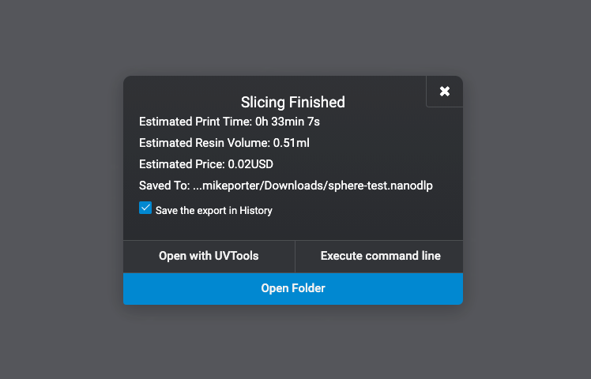
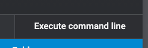
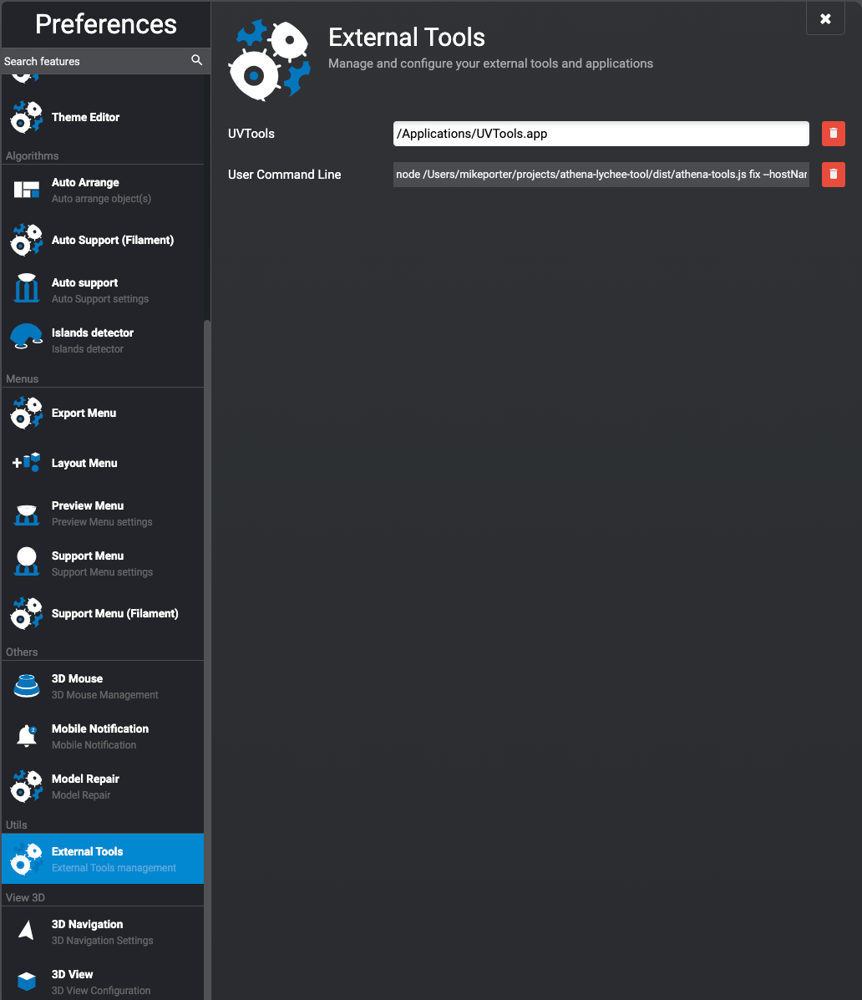

# Athena Tools

## Fix a Lychee Athena file
1. Install [nodejs](https://nodejs.org/en/download)
2. Download latest version of athena-tools from [releases](https://github.com/mikeporterdev/athena-tools/releases/)
3. Slice a lychee nanodlp file, do not connect directly to the printer, just slice a regular file and save it to your machine. None of the lychee settings will matter except for layer height. All other settings can be ignored.
4. Open a command line and type `node <./path/to/athena-tools.js> fix <path/to/nanodlpfile.nanodlp>`
5. The script will ask you for your printers hostname, you can use either IP address (eg. 192.168.0.160) or hostname (eg. enterprising-senna.local). Do not include http in this
6. The script will fetch your resin profiles from the printer, select which one you would like to use.
7. The script will fix your nanodlp file and upload it to your printer

## Example commands
`node athena-tools.js fix myfile.nanodlp`
This will ask you for your printer name, resin profile and then upload the fixed file

Alternatively, you can provide the hostname arguments eagerly.
`node athena-tools.js fix --hostName enterprising-senna.local myfile.nanodlp`

You can also provide the profile name eagerly at the same time. To do this you will need your Profile ID. 
`node athena-tools.js fix --hostName enterprising-senna.local --profileId 1000 myfile.nanodlp`

Profile ID can be found by going to your resin profile in the webui, clicking edit, and finding the number in the URL.

## Using within Lychee

Lychee supports executing a command line script with a file it just sliced.

By inputting the full command with all parameters provided into the Lychee settings, you can have this script upload 
straight from Lychee with no command line needed.

Go to the Lychee settings and navigate to the External Tools tab and fill in the full command into the User Command Line box.
However, for the file path, simply use ((file)), this will tell Lychee to fill in that part with the filepath to what it just sliced. 
Make sure to restart lychee after setting this value.

For example, my full lychee command is

`node /Users/mikeporter/projects/athena-lychee-tool/dist/athena-tools.js fix --hostName enterprising-senna.local --profileId 1013 ((file))`

Then, after slicing, click the "Execute command line" button after the slice is finished and the file will be sent to your printer.

#### Notes
- Unfortunately there is no way to have profile selection with this, you will only be able to use one profile like this.
- Lychee will not give you any feedback after the button is pressed, so you'll need to check your printer webui to see if it worked.
- Lychee will not give you any feedback if the script fails, I recommend running your command on the command line a few times to check you have it right.