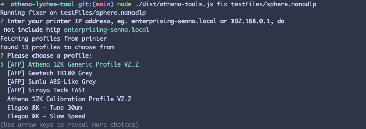
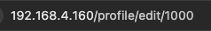
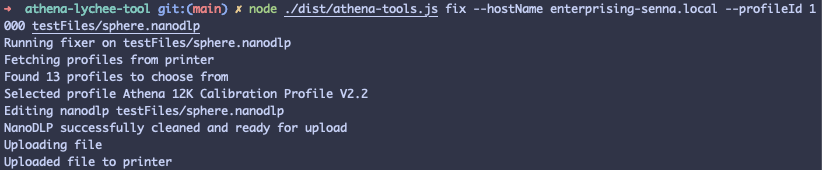

# Athena Tools

## Fix a Lychee Athena file
1. Install [nodejs](https://nodejs.org/en/download)
2. Download latest version of athena-tools from [releases](https://github.com/mikeporterdev/athena-tools/releases/)
3. Slice a lychee nanodlp file, do not connect directly to the printer, just slice a regular file and save it to your machine. None of the lychee settings will matter except for layer height. All other settings can be ignored.
4. Open a command line and type `node <./path/to/athena-tools.js> fix <path/to/nanodlpfile.nanodlp>`
5. The script will ask you for your printers hostname, you can use either IP address (eg. 192.168.0.160) or hostname (eg. enterprising-senna.local). Do not include http in this
6. The script will fetch your resin profiles from the printer, select which one you would like to use.
7. The script will fix your nanodlp file and upload it to your printer

## Example commands
`node athena-tools.js fix myfile.nanodlp`
This will ask you for your printer name, resin profile and then upload the fixed file

Alternatively, you can provide the hostname arguments eagerly.
`node athena-tools.js fix --hostName enterprising-senna.local myfile.nanodlp`

You can also provide the profile name eagerly at the same time. To do this you will need your Profile ID. 
`node athena-tools.js fix --hostName enterprising-senna.local --profileId 1000 myfile.nanodlp`

Profile ID can be found by going to your resin profile in the webui, clicking edit, and finding the number in the URL.

